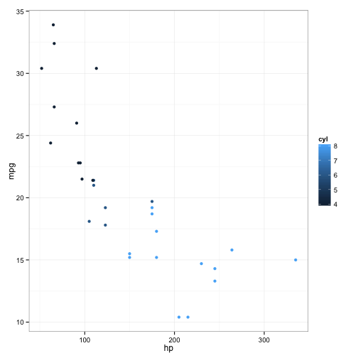

> ## Learning Objectives {.objectives}
>
> * Understand the 3 different ways R can address data inside a data frame.
> * Combine different methods for addressing data with the assignment operator to update subsets of data
> * Merge two data frames using a shared column
> * Sort a data frame

R is a powerful language for data manipulation. There are 3 main ways for addressing data inside R objects.

* By index (slicing)
* By logical vector
* By name (columns only)

Lets start by loading some sample data:

~~~{.r}
info <- read.csv(file="data/motor-info.csv")
~~~

Lets take a look at this data.

~~~{.r}
class(info)
~~~

~~~{.output}
[1] "data.frame"

~~~

R has loaded the contents of the .csv file into a variable called `info` which is a `data frame`.

~~~{.r}
dim(info)
~~~

~~~{.output}
[1] 32 11

~~~

~~~{.r}
nrow(info)
~~~

~~~{.output}
[1] 32

~~~

~~~{.r}
ncol(info)
~~~

~~~{.output}
[1] 11

~~~

The data has 32 rows and 11 columns.

~~~{.r}
head(info)
~~~

~~~{.output}
               make cyl disp  hp drat    wt  qsec vs am gear carb
1         Mazda RX4   6  160 110 3.90 2.620 16.46  0  1    4    4
2     Mazda RX4 Wag   6  160 110 3.90 2.875 17.02  0  1    4    4
3        Datsun 710   4  108  93 3.85 2.320 18.61  1  1    4    1
4    Hornet 4 Drive   6  258 110 3.08 3.215 19.44  1  0    3    1
5 Hornet Sportabout   8  360 175 3.15 3.440 17.02  0  0    3    2
6           Valiant   6  225 105 2.76 3.460 20.22  1  0    3    1

~~~

The `str` function gives a nice summary:

~~~{.r}
str(info)
~~~

~~~{.output}
'data.frame':	32 obs. of  11 variables:
 $ make: Factor w/ 32 levels "AMC Javelin",..: 18 19 5 13 14 31 7 21 20 22 ...
 $ cyl : int  6 6 4 6 8 6 8 4 4 6 ...
 $ disp: num  160 160 108 258 360 ...
 $ hp  : int  110 110 93 110 175 105 245 62 95 123 ...
 $ drat: num  3.9 3.9 3.85 3.08 3.15 2.76 3.21 3.69 3.92 3.92 ...
 $ wt  : num  2.62 2.88 2.32 3.21 3.44 ...
 $ qsec: num  16.5 17 18.6 19.4 17 ...
 $ vs  : int  0 0 1 1 0 1 0 1 1 1 ...
 $ am  : int  1 1 1 0 0 0 0 0 0 0 ...
 $ gear: int  4 4 4 3 3 3 3 4 4 4 ...
 $ carb: int  4 4 1 1 2 1 4 2 2 4 ...

~~~

The data are features of different makes of cars. (This is actually a standard R example data set called mtcars.)

### Addressing by Index

Data can be accessed by index. We have already seen how square brackets `[` can be used to subset (slice) data. The generic format is `info[row_numbers,column_numbers]`.

> ## Challenge - Selecting values 1 {.challenge}
>
> What will be returned by `info[1,1]`?

~~~{.r}
info[1,1]
~~~

~~~{.output}
[1] Mazda RX4
32 Levels: AMC Javelin Cadillac Fleetwood Camaro Z28 ... Volvo 142E

~~~

If we leave out a dimension R will interpret this as a request for all values in that dimension.

> ## Challenge - Selecting values 2 {.challenge}
>
> What will be returned by `info[,2]`?

The colon `:` can be used to create a sequence of integers.

~~~{.r}
6:9
~~~

~~~{.output}
[1] 6 7 8 9

~~~

Creates a vector of numbers from 6 to 9.

This can be very useful for addressing data.

> ## Challenge - Subsetting with sequences {.challenge}
> Use the colon operator to index just the aneurism count data (columns 6 to 9).

Finally we can use the `c()` (combine) function to address non-sequential rows and columns.

~~~{.r}
info[c(1,5,7,9),1:5]
~~~

~~~{.output}
               make cyl  disp  hp drat
1         Mazda RX4   6 160.0 110 3.90
5 Hornet Sportabout   8 360.0 175 3.15
7        Duster 360   8 360.0 245 3.21
9          Merc 230   4 140.8  95 3.92

~~~

Returns the first 5 columns for cars in rows 1,5,7 & 9

> ## Challenge - Subsetting non-sequential data {.challenge}
> Return the Age and Gender values for the first 5 patients.

### Addressing by column name

Columns in an R data frame are named.

~~~{.r}
colnames(info)
~~~

~~~{.output}
 [1] "make" "cyl"  "disp" "hp"   "drat" "wt"   "qsec" "vs"   "am"   "gear"
[11] "carb"

~~~

> ## Tip {.callout}
>
> If names are not specified e.g. using `headers=FALSE` in a `read.csv()` function, R assigns default names `V1,V2,...,Vn`

We usually use the `$` operator to address a column by name

~~~{.r}
info$cyl
~~~

~~~{.output}
 [1] 6 6 4 6 8 6 8 4 4 6 6 8 8 8 8 8 8 4 4 4 4 8 8 8 8 4 4 4 8 6 8 4

~~~

Named addressing can also be used in square brackets.

~~~{.r}
head( info[,c('cyl','hp')] )
~~~

~~~{.output}
  cyl  hp
1   6 110
2   6 110
3   4  93
4   6 110
5   8 175
6   6 105

~~~

> ## Best Practice {.callout}
>
> Best practice is to address columns by name, often you will create or delete columns and the column position will change.

### Logical indexing

A logical vector contains only the special values `TRUE` & `FALSE`.

~~~{.r}
c(TRUE,TRUE,FALSE,FALSE,TRUE)
~~~

~~~{.output}
[1]  TRUE  TRUE FALSE FALSE  TRUE

~~~
> ## Tip {.callout}
>
> Note the values `TRUE` and `FALSE` are all capital letters and are not quoted.

Logical vectors can be created using `relational operators` e.g. `<, >, ==, !=, %in%`.

~~~{.r}
x <- c(1,2,3,11,12,13)
x < 10
~~~

~~~{.output}
[1]  TRUE  TRUE  TRUE FALSE FALSE FALSE

~~~

~~~{.r}
x %in% 1:10
~~~

~~~{.output}
[1]  TRUE  TRUE  TRUE FALSE FALSE FALSE

~~~

We can use logical vectors to select data from a data frame.

~~~{.r}
index <- info$cyl == 6
info[index,]$hp
~~~

~~~{.output}
[1] 110 110 110 105 123 123 175

~~~

Often this operation is written as one line of code:

~~~{.r}
plot(info[info$cyl==6,]$hp)
~~~

> ## Challenge - Using logical indexes {.challenge}
> 1. Create a scatterplot showing BloodPressure for subjects not in the control group.
> 2. How many ways are there to index this set of subjects?

### Combining Indexing and Assignment

The assignment operator `<-` can be combined with indexing.

~~~{.r}
x<-c(1,2,3,11,12,13)
x[x < 10] <- 0
x
~~~

~~~{.output}
[1]  0  0  0 11 12 13

~~~

> ## Challenge - Updating a subset of values {.challenge}
> In this dataset, values for Gender have been recorded as both uppercase `M, F` and lowercase `m,f`.
> Combine the indexing and assignment operations to convert all values to lowercase.

## Merging data

The magazine Motor Trends measured the miles-per-gallon of each of these cars. We want to merge this with our existing data frame.

~~~{.r}
mpg <- read.csv("data/motor-mpg.csv")
head(mpg)
~~~

~~~{.output}
           make  mpg
1      Merc 230 22.8
2  Ferrari Dino 19.7
3 Toyota Corona 21.5
4     Fiat X1-9 27.3
5       Valiant 18.1
6      Fiat 128 32.4

~~~

~~~{.r}
dim(mpg)
~~~

~~~{.output}
[1] 30  2

~~~

Hmm. This data frame has slightly less rows, and they're in a different order.

~~~{.r}
mpg$make %in% info$make
~~~

~~~{.output}
 [1] TRUE TRUE TRUE TRUE TRUE TRUE TRUE TRUE TRUE TRUE TRUE TRUE TRUE TRUE
[15] TRUE TRUE TRUE TRUE TRUE TRUE TRUE TRUE TRUE TRUE TRUE TRUE TRUE TRUE
[29] TRUE TRUE

~~~

~~~{.r}
all(mpg$make %in% info$make)
~~~

~~~{.output}
[1] TRUE

~~~

The `merge` function can be used to merge the two data frames:

~~~{.r}
combined <- merge(info, mpg, by="make")
head(combined)
~~~

~~~{.output}
                make cyl disp  hp drat    wt  qsec vs am gear carb  mpg
1        AMC Javelin   8  304 150 3.15 3.435 17.30  0  0    3    2 15.2
2 Cadillac Fleetwood   8  472 205 2.93 5.250 17.98  0  0    3    4 10.4
3         Camaro Z28   8  350 245 3.73 3.840 15.41  0  0    3    4 13.3
4  Chrysler Imperial   8  440 230 3.23 5.345 17.42  0  0    3    4 14.7
5         Datsun 710   4  108  93 3.85 2.320 18.61  1  1    4    1 22.8
6   Dodge Challenger   8  318 150 2.76 3.520 16.87  0  0    3    2 15.5

~~~

~~~{.r}
dim(combined)
~~~

~~~{.output}
[1] 30 12

~~~

We see we have only 30 rows. If we want to not discard rows that can't be merged, we can specify `all=TRUE` (or possibly `all.x=TRUE` or `all.y=TRUE`).

~~~{.r}
combined_all <- merge(info, mpg, by="make", all=TRUE)
dim(combined_all)
~~~

~~~{.output}
[1] 32 12

~~~

~~~{.r}
combined_all
~~~

~~~{.output}
                  make cyl  disp  hp drat    wt  qsec vs am gear carb  mpg
1          AMC Javelin   8 304.0 150 3.15 3.435 17.30  0  0    3    2 15.2
2   Cadillac Fleetwood   8 472.0 205 2.93 5.250 17.98  0  0    3    4 10.4
3           Camaro Z28   8 350.0 245 3.73 3.840 15.41  0  0    3    4 13.3
4    Chrysler Imperial   8 440.0 230 3.23 5.345 17.42  0  0    3    4 14.7
5           Datsun 710   4 108.0  93 3.85 2.320 18.61  1  1    4    1 22.8
6     Dodge Challenger   8 318.0 150 2.76 3.520 16.87  0  0    3    2 15.5
7           Duster 360   8 360.0 245 3.21 3.570 15.84  0  0    3    4 14.3
8         Ferrari Dino   6 145.0 175 3.62 2.770 15.50  0  1    5    6 19.7
9             Fiat 128   4  78.7  66 4.08 2.200 19.47  1  1    4    1 32.4
10           Fiat X1-9   4  79.0  66 4.08 1.935 18.90  1  1    4    1 27.3
11      Ford Pantera L   8 351.0 264 4.22 3.170 14.50  0  1    5    4 15.8
12         Honda Civic   4  75.7  52 4.93 1.615 18.52  1  1    4    2 30.4
13      Hornet 4 Drive   6 258.0 110 3.08 3.215 19.44  1  0    3    1 21.4
14   Hornet Sportabout   8 360.0 175 3.15 3.440 17.02  0  0    3    2 18.7
15 Lincoln Continental   8 460.0 215 3.00 5.424 17.82  0  0    3    4 10.4
16        Lotus Europa   4  95.1 113 3.77 1.513 16.90  1  1    5    2 30.4
17       Maserati Bora   8 301.0 335 3.54 3.570 14.60  0  1    5    8 15.0
18           Mazda RX4   6 160.0 110 3.90 2.620 16.46  0  1    4    4   NA
19       Mazda RX4 Wag   6 160.0 110 3.90 2.875 17.02  0  1    4    4 21.0
20            Merc 230   4 140.8  95 3.92 3.150 22.90  1  0    4    2 22.8
21           Merc 240D   4 146.7  62 3.69 3.190 20.00  1  0    4    2 24.4
22            Merc 280   6 167.6 123 3.92 3.440 18.30  1  0    4    4 19.2
23           Merc 280C   6 167.6 123 3.92 3.440 18.90  1  0    4    4 17.8
24          Merc 450SE   8 275.8 180 3.07 4.070 17.40  0  0    3    3   NA
25          Merc 450SL   8 275.8 180 3.07 3.730 17.60  0  0    3    3 17.3
26         Merc 450SLC   8 275.8 180 3.07 3.780 18.00  0  0    3    3 15.2
27    Pontiac Firebird   8 400.0 175 3.08 3.845 17.05  0  0    3    2 19.2
28       Porsche 914-2   4 120.3  91 4.43 2.140 16.70  0  1    5    2 26.0
29      Toyota Corolla   4  71.1  65 4.22 1.835 19.90  1  1    4    1 33.9
30       Toyota Corona   4 120.1  97 3.70 2.465 20.01  1  0    3    1 21.5
31             Valiant   6 225.0 105 2.76 3.460 20.22  1  0    3    1 18.1
32          Volvo 142E   4 121.0 109 4.11 2.780 18.60  1  1    4    2 21.4

~~~

`NA` is a special value R uses to indicate missing data.

We might wish to save the combined data frame to a new CSV file.

~~~{.r}
write.csv(combined_all, "combined.csv", row.names=FALSE)
~~~

We can use the plotting functions we learned about in M1 to examine this data.

~~~{.r}
library(ggplot2)
~~~

~~~{.output}
Loading required package: methods

Attaching package: 'ggplot2'

The following object is masked _by_ '.GlobalEnv':

    mpg

~~~

~~~{.r}
ggplot(combined_all, aes(x=hp,y=mpg,color=cyl)) + geom_point() + theme_bw()
~~~

~~~{.output}
Warning: Removed 2 rows containing missing values (geom_point).

~~~

## Sorting data

Suppose we wanted to order rows, for example by number of cylinders. The `sort` function sorts a vectors, so we could:

~~~{.r}
sort(combined_all$cyl)
~~~

~~~{.output}
 [1] 4 4 4 4 4 4 4 4 4 4 4 6 6 6 6 6 6 6 8 8 8 8 8 8 8 8 8 8 8 8 8 8

~~~

However we don't just want a sorted version of this column, we want all the columns. The `order` function gives the order required to sort a vector:

~~~{.r}
order(combined_all$cyl)
~~~

~~~{.output}
 [1]  5  9 10 12 16 20 21 28 29 30 32  8 13 18 19 22 23 31  1  2  3  4  6
[24]  7 11 14 15 17 24 25 26 27

~~~

So we can use this to sort the data frame:

~~~{.r}
combined_all[ order(combined_all$cyl), ]
~~~

~~~{.output}
                  make cyl  disp  hp drat    wt  qsec vs am gear carb  mpg
5           Datsun 710   4 108.0  93 3.85 2.320 18.61  1  1    4    1 22.8
9             Fiat 128   4  78.7  66 4.08 2.200 19.47  1  1    4    1 32.4
10           Fiat X1-9   4  79.0  66 4.08 1.935 18.90  1  1    4    1 27.3
12         Honda Civic   4  75.7  52 4.93 1.615 18.52  1  1    4    2 30.4
16        Lotus Europa   4  95.1 113 3.77 1.513 16.90  1  1    5    2 30.4
20            Merc 230   4 140.8  95 3.92 3.150 22.90  1  0    4    2 22.8
21           Merc 240D   4 146.7  62 3.69 3.190 20.00  1  0    4    2 24.4
28       Porsche 914-2   4 120.3  91 4.43 2.140 16.70  0  1    5    2 26.0
29      Toyota Corolla   4  71.1  65 4.22 1.835 19.90  1  1    4    1 33.9
30       Toyota Corona   4 120.1  97 3.70 2.465 20.01  1  0    3    1 21.5
32          Volvo 142E   4 121.0 109 4.11 2.780 18.60  1  1    4    2 21.4
8         Ferrari Dino   6 145.0 175 3.62 2.770 15.50  0  1    5    6 19.7
13      Hornet 4 Drive   6 258.0 110 3.08 3.215 19.44  1  0    3    1 21.4
18           Mazda RX4   6 160.0 110 3.90 2.620 16.46  0  1    4    4   NA
19       Mazda RX4 Wag   6 160.0 110 3.90 2.875 17.02  0  1    4    4 21.0
22            Merc 280   6 167.6 123 3.92 3.440 18.30  1  0    4    4 19.2
23           Merc 280C   6 167.6 123 3.92 3.440 18.90  1  0    4    4 17.8
31             Valiant   6 225.0 105 2.76 3.460 20.22  1  0    3    1 18.1
1          AMC Javelin   8 304.0 150 3.15 3.435 17.30  0  0    3    2 15.2
2   Cadillac Fleetwood   8 472.0 205 2.93 5.250 17.98  0  0    3    4 10.4
3           Camaro Z28   8 350.0 245 3.73 3.840 15.41  0  0    3    4 13.3
4    Chrysler Imperial   8 440.0 230 3.23 5.345 17.42  0  0    3    4 14.7
6     Dodge Challenger   8 318.0 150 2.76 3.520 16.87  0  0    3    2 15.5
7           Duster 360   8 360.0 245 3.21 3.570 15.84  0  0    3    4 14.3
11      Ford Pantera L   8 351.0 264 4.22 3.170 14.50  0  1    5    4 15.8
14   Hornet Sportabout   8 360.0 175 3.15 3.440 17.02  0  0    3    2 18.7
15 Lincoln Continental   8 460.0 215 3.00 5.424 17.82  0  0    3    4 10.4
17       Maserati Bora   8 301.0 335 3.54 3.570 14.60  0  1    5    8 15.0
24          Merc 450SE   8 275.8 180 3.07 4.070 17.40  0  0    3    3   NA
25          Merc 450SL   8 275.8 180 3.07 3.730 17.60  0  0    3    3 17.3
26         Merc 450SLC   8 275.8 180 3.07 3.780 18.00  0  0    3    3 15.2
27    Pontiac Firebird   8 400.0 175 3.08 3.845 17.05  0  0    3    2 19.2

~~~

> ## Challenge {.challenge}
>
> Show the top 5 best cars in terms of miles-per-gallon.
> (Look at the documentation for order to see how to sort in descending order, `?order`)
>
> What does order do with missing values (NA)?
>
