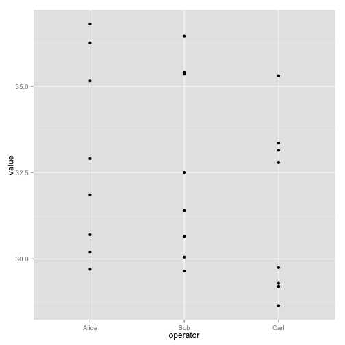

# Welcome to R

# Loading data

Our example data is quality measurements (particle size) on some PVC plastic production, using eight different resin batches, and three different machine operators.

~~~{.r}
read.csv(file="data/pvc.csv", row.names=1)
~~~

~~~{.r}
dat <- read.csv(file="data/pvc.csv", row.names=1)
~~~

~~~{.r}
dat
~~~

~~~{.output}
       Alice   Bob  Carl
Resin1 36.25 35.40 35.30
Resin2 35.15 35.35 33.35
Resin3 30.70 29.65 29.20
Resin4 29.70 30.05 28.65
Resin5 31.85 31.40 29.30
Resin6 30.20 30.65 29.75
Resin7 32.90 32.50 32.80
Resin8 36.80 36.45 33.15

~~~

~~~{.r}
class(dat)
~~~

~~~{.output}
[1] "data.frame"

~~~

~~~{.r}
str(dat)
~~~

~~~{.output}
'data.frame':	8 obs. of  3 variables:
 $ Alice: num  36.2 35.1 30.7 29.7 31.9 ...
 $ Bob  : num  35.4 35.4 29.6 30.1 31.4 ...
 $ Carl : num  35.3 33.4 29.2 28.6 29.3 ...

~~~

`read.csv` has loaded the data as a data frame, but actually it is a matrix. In a data frame the columns contain different types of data, but in a matrix all the elements are the same type of data. A data frame contains a collection of "things" (rows) each with a set of properties (columns) of different types. A matrix in R is like a mathematical matrix, containing all the same type of thing (usually numbers).

R often but not always lets these be used interchangably. Let us insist to R that what we have is a matrix.

~~~{.r}
mat <- as.matrix(dat)
class(mat)
~~~

~~~{.output}
[1] "matrix"

~~~

Much better.

# A t-test or two

~~~{.r}
mat[1,]
~~~

~~~{.output}
Alice   Bob  Carl 
36.25 35.40 35.30 

~~~

~~~{.r}
mat[2,]
~~~

~~~{.output}
Alice   Bob  Carl 
35.15 35.35 33.35 

~~~

~~~{.r}
t.test(mat[1,], mat[2,])
~~~

~~~{.output}

	Welch Two Sample t-test

data:  mat[1, ] and mat[2, ]
t = 1.4683, df = 2.855, p-value = 0.2427
alternative hypothesis: true difference in means is not equal to 0
95 percent confidence interval:
 -1.271985  3.338652
sample estimates:
mean of x mean of y 
 35.65000  34.61667 

~~~

Actually, this can be considered a paired sample t-test.

~~~{.r}
t.test(mat[1,], mat[2,], paired=TRUE)
~~~

~~~{.output}

	Paired t-test

data:  mat[1, ] and mat[2, ]
t = 1.8805, df = 2, p-value = 0.2008
alternative hypothesis: true difference in means is not equal to 0
95 percent confidence interval:
 -1.330952  3.397618
sample estimates:
mean of the differences 
               1.033333 

~~~

> ## Challenge - using t.test {.challenge}
>
> Can you find a significant difference between any two resins?

When we call t.test it returns an object that behaves like a `list`. Recall that in R a `list` is a miscellaneous collection of data.

~~~{.r}
result <- t.test(mat[1,], mat[2,], paired=TRUE)
names(result)
~~~

~~~{.output}
[1] "statistic"   "parameter"   "p.value"     "conf.int"    "estimate"   
[6] "null.value"  "alternative" "method"      "data.name"  

~~~

~~~{.r}
result$p.value
~~~

~~~{.output}
[1] 0.2007814

~~~

This means we can write software that uses the various results from t-test, for example performing a whole lot of t-tests and reporting the significant results.

# A proper example of a data frame

Instead of storing this data in a matrix, we could store each measurement in a row of a data frame. We can convert to this "long" form with the `melt` function in the library `reshape2`.

~~~{.r}
library(reshape2)
long <- melt(mat)
head(long)
~~~

~~~{.output}
    Var1  Var2 value
1 Resin1 Alice 36.25
2 Resin2 Alice 35.15
3 Resin3 Alice 30.70
4 Resin4 Alice 29.70
5 Resin5 Alice 31.85
6 Resin6 Alice 30.20

~~~

~~~{.r}
colnames(long) <- c("resin","operator","value")
head(long)
~~~

~~~{.output}
   resin operator value
1 Resin1    Alice 36.25
2 Resin2    Alice 35.15
3 Resin3    Alice 30.70
4 Resin4    Alice 29.70
5 Resin5    Alice 31.85
6 Resin6    Alice 30.20

~~~

This long form is often the best form for exploration and statistical testing of data.

R has a built in plotting facility, with functions like `plot`.

A more recent and much more powerful plotting library is `ggplot2`. The syntax is a little strange, but there are plenty of examples in the online documentation.

If `ggplot2` isn't already installed, we need to install it.

~~~{.r}
install.packages("ggplot2")
~~~

~~~{.output}
Loading required package: methods

~~~

A simple example:

~~~{.r}
ggplot(long, aes(x=operator, y=value)) + geom_point()
~~~

The call to `ggplot` sets up the basics of how we are going to represent the various columns of the data frame. We then literally add layers of graphics to this.

~~~{.r}
ggplot(long, aes(x=operator, y=value)) + geom_boxplot() + geom_point()
~~~

~~~{.r}
ggplot(long, aes(x=operator, y=value, group=resin, color=resin)) + geom_line()
~~~

This long form is also ideal for statistical testing. Here is a one-way ANOVA.

~~~{.r}
oneway.test(value ~ resin, data=long)
~~~

~~~{.output}

	One-way analysis of means (not assuming equal variances)

data:  value and resin
F = 26.6047, num df = 7.000, denom df = 6.537, p-value = 0.0002445

~~~

A two-way ANOVA analysis would be better here. This is *well* beyond the scope of this course, but could be achived with something like:

~~~{.r}
anova(lm(value ~ resin + operator, data=long))
~~~

~~~{.output}
Analysis of Variance Table

Response: value
          Df  Sum Sq Mean Sq F value    Pr(>F)    
resin      7 141.973 20.2818  39.615 3.599e-08 ***
operator   2  10.359  5.1795  10.117  0.001913 ** 
Residuals 14   7.168  0.5120                      
---
Signif. codes:  0 '***' 0.001 '**' 0.01 '*' 0.05 '.' 0.1 ' ' 1

~~~
